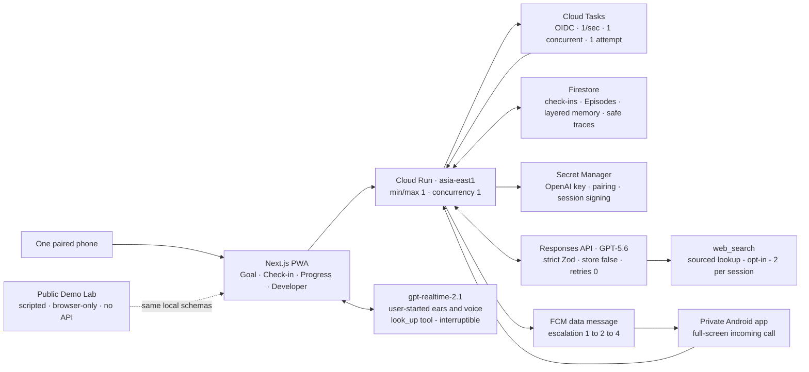

# Time Sovereignty

**An AI Chief of Staff that protects a meaningful goal when real life interrupts.**

Built with Codex for OpenAI Build Week 2026. GPT-5.6 is the product's
structured decision brain—not a decorative chat box.

- **Public 30-day Demo Lab:**
  https://live-mobile---time-sovereignty-defqnamrrq-de.a.run.app/demo
- **Under-three-minute submission video:**
  https://youtu.be/d0cX1V4R7h4
- **Stable app:** https://time-sovereignty-defqnamrrq-de.a.run.app
- **Source:** https://github.com/rainingsnow0914tw-ship-it/time-sovereignty-2026
- **License:** [MIT](LICENSE)
- **Primary Codex `/feedback` Session ID:**
  `019f6085-1e4d-7e23-a0b8-371e6e47bbfa`

## Why this exists

Most productivity tools are good at making the first plan. They are much less
useful when the action is delayed, the method is blocked, the user's energy
changes, or the original goal no longer fits reality.

Time Sovereignty treats those moments as information instead of failure. It
keeps the North Star, current commitment, consent boundaries, progress
evidence, learned strategies, and exact resume point connected over time.

The clearest real-world acceptance was unexpectedly simple: a user who had
bought art supplies but had not started drawing accepted a 20-minute cup-sketch
commitment. The physical Android PWA brought the check-in back, accepted a real
photo and self-assessment, and GPT-5.6 recognized the visible cup structure and
the user's continuous-line approach. The user finished a drawing. The photo was
an ephemeral model input and was not stored.

## What works

- Three-question onboarding with a real GPT-5.6 Goal Architect.
- Goal-led cadence: short sprint, finite project, or ongoing habit—never a
  forced thirty-day plan.
- Editable support agreement covering quiet hours, tone, channels, pause
  conditions, progress formats, and consent for firmer follow-up.
- Real Cloud Tasks check-ins with Google OIDC, open-PWA polling, text, photo,
  voice transcription, standard TTS, and user-started Realtime voice.
- Need-based Agent routing: Chief of Staff, Goal Architect, Commitment
  Recovery, and post-response Memory Curator.
- Immutable Episodes plus user-scoped and goal-scoped derived memory.
- A Progress Witness and Self-Belief Loop that gives evidence-specific
  recognition without turning one success into a permanent claim about the
  user.
- Safe Developer traces with provider, returned model, schema, token usage,
  record IDs, and revision—never raw prompts, media, secrets, or private
  reasoning.
- A separate, public `/demo` that compresses a clearly scripted thirty-day
  illustration story without calling any API or reading the private session.

## Real product vs. scripted proof

| Surface | Purpose | Provider and data boundary |
| --- | --- | --- |
| Private Android journey | Real onboarding, scheduled check-in, photo/voice/text reply, GPT-5.6 decision, confirmation, memory, and follow-up | Real Cloud Run, Cloud Tasks, Firestore, GPT-5.6; one paired device; server-side key |
| Public `/demo` | Show the longitudinal Day 1→30 story in under two minutes | Browser-only scripted fixtures; every trace says `mock`; no `/api/*`, Firestore, key, or private data |
| Routine tests | Fast, deterministic contract development | Mock provider behind the same strict Zod schemas |
| Recorded evidence | Prove finalized live contracts and cloud behavior | A small number of deliberate real calls, zero SDK retries |

This separation is deliberate. The competition story is fast to inspect, while
the real user path remains private and cannot expose Chloe's phone session or
the project API key.

## Architecture



The action state machine and intervention state machine remain independent.
Idempotency is enforced at task name, reply ID, transactional lease, completed
receipt, and curation lease boundaries.

## How GPT-5.6 is used

The application requests `gpt-5.6` through the official Responses API. The
provider returned `gpt-5.6-sol` in the recorded live runs.

1. **Goal Architect** turns three natural answers into a specific goal plan and
   defensible cadence.
2. **Chief of Staff** reads current evidence and relevant limited memory, then
   selects the smallest useful Agent path and returns one structured decision.
3. **Commitment Recovery** joins only when a report is blocked, repeatedly
   delayed, or directionally changed.
4. **Memory Curator** runs after the user-facing decision so curation does not
   add mobile latency. It may create a tentative Strategy Card; durable user
   conclusions still require an explicit user choice.

The required two-check-in memory acceptance used two Chief calls and two
post-response Curator calls, 5,447 tokens total, with zero SDK retries. The
second check-in retrieved exactly one relevant Strategy Card, treated it as
limited evidence, and updated confidence from 0.35 to 0.47 after one later
success while preserving `TENTATIVE` status.

`gpt-realtime-2.1` is a separate, user-started ears/mouth layer. It transcribes
and speaks; GPT-5.6 remains the structured decision brain.

## How Codex built it

Codex was the primary engineering environment from clean repository to real
phone acceptance. Chloe supplied the product intent and challenged assumptions;
Codex implemented, deployed, tested, and maintained the evidence chain.

Codex accelerated the project by:

- translating the PRD and architecture into strict domain schemas, two state
  machines, four Agent contracts, and mock/live provider parity;
- creating dated decision records before large scope changes and a lightweight
  `AGENTS.md` + `docs/PROJECT_STATE.md` handoff system for long-session safety;
- provisioning and inspecting Cloud Run, Firestore, Cloud Tasks, IAM/OIDC,
  Secret Manager, budgets, and tag-only preview revisions through GCP CLI;
- driving physical Android acceptance through ADB while keeping human judgment
  for audio quality, photo meaning, and product experience;
- finding production-only defects that local happy paths missed: Firestore REST
  serialization, swallowed PowerShell JSON, missing standalone task protos,
  a three-trace client bound, Realtime token cutoff, stale installed-PWA code,
  completed-journey dead-end, and server/phone hydration timezone mismatch;
- recording every real model call, token count, revision, test result, failure,
  and repair instead of presenting the final code as a one-prompt artifact.

The chronological proof is in [the Codex build log](docs/CODEX_BUILD_LOG.md),
[decisions](docs/decisions/), and [evidence](docs/evidence/).

## Safety, privacy, and cost controls

- The OpenAI key exists only in ignored local configuration and Cloud Secret
  Manager. It never reaches JavaScript, the PWA, a URL, or the repository.
- Private access uses a signed HttpOnly/Secure/SameSite=Strict cookie, exact
  origin allowlist, single-device revocation, and a 96-hour session with a
  seven-day schema maximum.
- Photos are sent only as ephemeral model input. Persisted evidence contains
  structured kinds and decisions, not raw media or raw replies.
- OpenAI SDK retries are zero. Cloud Tasks uses one attempt, one dispatch per
  second, one concurrent dispatch, deterministic names, and transactional
  duplicate suppression.
- Cloud Run stays in `asia-east1` with minimum one, maximum one, and container
  concurrency one during judging.
- The public Demo Lab made zero `/api/*` requests in both local production and
  Cloud Run browser acceptance.

## Try it without rebuilding

Open the [public Demo Lab](https://live-mobile---time-sovereignty-defqnamrrq-de.a.run.app/demo):

1. Read the explicit scripted/no-API boundary.
2. Press **Run full 30-day story**.
3. Open **Journey** to see delay, recovery, memory, progress, and calibration.
4. Open **Developer** to inspect all four schema-validated mock traces.

The private live phone path intentionally requires a one-time pairing code and
is not offered as a public guest account. Its real behavior is documented in
the evidence files and demonstrated in the submission video.

## Run locally

Requirements: Node.js 20+ and npm.

```bash
npm ci
npm test
npm run lint
npm run typecheck
npm run build
npm run dev
```

Then open `http://localhost:3000/demo`. The Demo Lab and routine test suite do
not need an OpenAI API key.

Live provider checks are deliberately separate and potentially billable:

- `npm run smoke:openai`
- `npm run test:live:goal-architect`
- `npm run test:live:check-in`
- `npm run test:live:memory-curator`
- `npm run test:live:phase4-contracts`

Do not run them casually. They require `OPENAI_API_KEY` in ignored local
configuration and preserve zero automatic SDK retries.

## Current verified state

- 125 routine tests passed; 9 deliberate live-only tests skipped.
- ESLint, TypeScript, production build, and diff check passed.
- Private memory acceptance revision: `time-sovereignty-00036-qov`.
- Accepted Demo Lab revision: `time-sovereignty-00038-zey`, `live-mobile` tag,
  0% normal traffic.
- Stable revision: `time-sovereignty-00024-dih`, 100% normal traffic.
- Public Demo Lab: HTTP 200, Day 30, mock trace visible, zero `/api/*`, zero
  framework overlays, zero console errors at 390×844.

## Evidence map

- [Real focus loop and ephemeral photo](docs/evidence/private-session-recovery-and-real-focus-loop-2026-07-18.md)
- [Real multimodal Android correction](docs/evidence/live-multimodal-android-acceptance-2026-07-18.md)
- [Real memory learning loop](docs/evidence/real-memory-learning-loop-2026-07-19.md)
- [Cloud Demo Lab browser acceptance](docs/evidence/demo-lab-browser-acceptance-2026-07-19.md)
- [Live Goal Architect contract](docs/evidence/live-goal-cadence-contract-2026-07-18.md)
- [Realtime Android voice acceptance](docs/evidence/realtime-android-production-acceptance-2026-07-18.md)
- [Full dated build log](docs/CODEX_BUILD_LOG.md)

## Honest limitations and next steps

- Real check-in polling currently requires the PWA to remain open near the due
  time; background push and lock-screen vibration are future integrations.
- The public evaluator path is scripted and local-only by design. A rate-limited
  live Guest Lane was cut to protect submission time and private data.
- Web Search remains behind a provider interface and was not allowed to delay
  memory acceptance or submission.
- Future versions can add wearables, smart speakers, calendar/email adapters,
  and richer research support behind the same consent, trace, and memory
  boundaries.

## Submission package

- [Under-three-minute video script](docs/DEMO_SCRIPT.md)
- [Devpost submission draft](docs/DEVPOST_SUBMISSION.md)
- [Submission checklist](docs/SUBMISSION_CHECKLIST.md)
- [Architecture source](docs/submission/time-sovereignty-architecture.mmd)

Copyright © 2026 Chloe. Released under the [MIT License](LICENSE).
