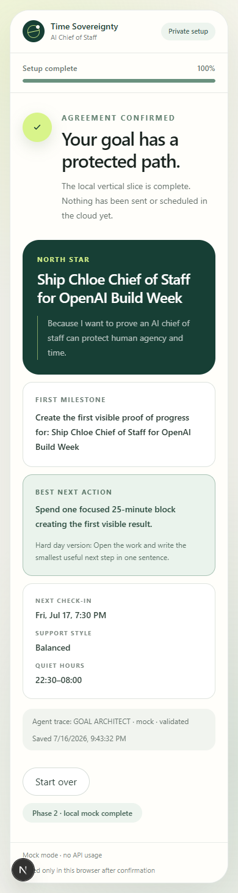

# Phase 2 Local Vertical Slice Evidence

- Date: 2026-07-16 (Asia/Shanghai)
- Mode: deterministic mock provider; no OpenAI API request
- Scope: onboarding, goal-plan confirmation, support agreement, local persistence
- Result: PASS

## Exit-gate result

The user can complete the Phase 2 path in one browser session:

1. answer the three required onboarding questions, one at a time;
2. receive a schema-validated Goal Architect mock plan;
3. inspect, adjust, or attach explicit concern feedback to that plan;
4. confirm the plan;
5. review and confirm check-in rhythm, quiet hours, intervention intensity,
   tone, channels, progress formats, pause conditions, stronger-follow-up
   consent, and agreement review frequency;
6. persist a validated goal, action, support agreement, plan, and safe agent
   trace in local browser storage;
7. reload the page and restore the confirmed agreement.

## Automated verification

The full browser path was executed in local Chrome at a `390x844` mobile
viewport using test-only answers. The final assertions reported:

```json
{
  "result": "PASS",
  "viewport": "390x844",
  "completedGoal": "Ship Chloe Chief of Staff for OpenAI Build Week",
  "provider": "mock",
  "traceAgent": "GOAL_ARCHITECT",
  "localStoragePersistedAfterReload": true,
  "browserConsoleErrors": []
}
```

The browser test used `http://localhost:3100`. An earlier diagnostic run used
`127.0.0.1`; Next.js correctly blocked that cross-origin development resource,
so it was not counted as product evidence.

## Code verification

All final checks passed after the browser path:

- `npm run typecheck`
- `npm test`: 5 files, 21 tests passed
- `npm run lint`
- `npm run build`: optimized Next.js production build completed; `/` is
  statically prerendered

The automated tests cover mock Goal Architect output validation, plan-feedback
validation, local record construction, storage round-trip, malformed-data
fail-closed behavior, domain schemas, both state machines, and mock-provider
trace behavior.

## Visual evidence



## Honest boundary

This phase proves the local mock vertical slice only. It does not claim:

- Firestore application persistence;
- creation or delivery of a real Cloud Task;
- an authenticated Cloud Tasks callback;
- a callback-driven Firestore transition;
- live four-agent OpenAI orchestration;
- notification or progress-sharing delivery.

Those items remain Phase 3 and later work.
