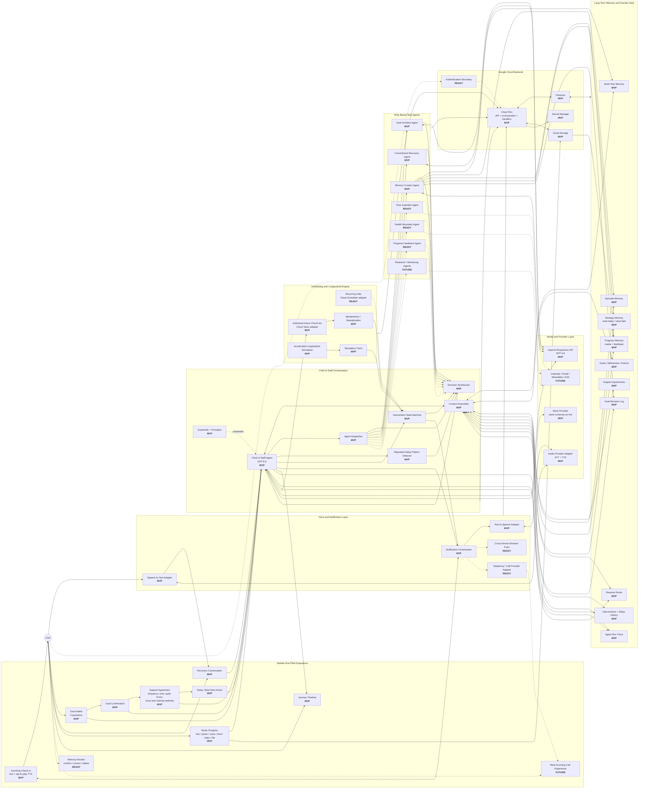
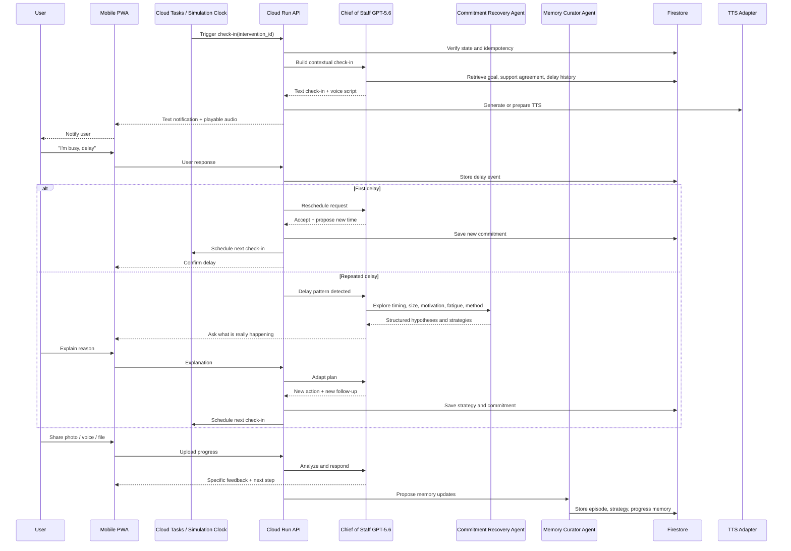

# Time Sovereignty

## Architecture v2
### Product Architecture and Build Week Implementation Map

This document is the architecture companion to `01_Time_Sovereignty_PRD_v0.6.md`.

## Status Legend

- **MVP** = `IMPLEMENTED_IN_MVP`
- **READY** = `INTERFACE_PREPARED`
- **FUTURE** = `FUTURE`



---

## Main Runtime Flow



---

## Repository Boundary Recommendation

```text
apps/
  web/                    # Mobile-first PWA

packages/
  agents/
    chief-of-staff/
    goal-architect/
    commitment-recovery/
    memory-curator/
    interfaces/           # Future agent contracts
  domain/
    goals/
    actions/
    interventions/
    memories/
    support-agreements/
    simulations/
  providers/
    openai/
    mock/
    tts/
    stt/
    notifications/
    scheduling/
    storage/
  ui/
  config/

services/
  api/                    # Cloud Run service if separated
  worker/                 # Optional future split

docs/
  product/
  architecture/
  decisions/
  codex-handoffs/
```

A single Next.js repository is acceptable for Build Week if it preserves these logical boundaries.

---

## Implementation Principle

The full architecture is intentional.

Do not delete future rooms because they are not implemented this week.

Create stable interfaces, schemas, and status labels, but complete the required vertical slice before expanding functionality.
